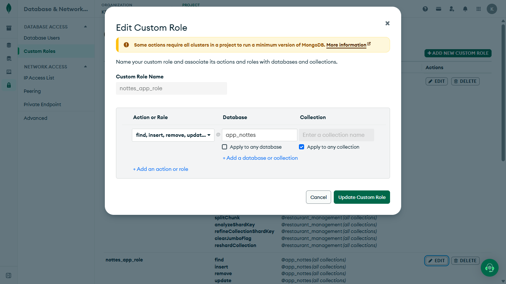

### Configuración Variables de Entorno

#### 1. Crear el Custom Role en MongoDB Atlas

Antes de conectar la app, crea un rol con permisos específicos para tu base de datos (no uses el usuario admin por defecto).

1. Ve a **Database Access → Custom Roles → Add New Custom Role**.
2. Ponle un nombre al rol, por ejemplo: `nottes_app_role`.
3. En **Action or Role**, selecciona **Collection Actions** (esto incluye automáticamente las acciones básicas necesarias: `find`, `insert`, `remove`, `update`, entre otras).
4. En **Database**, escribe el nombre de tu base de datos (ej: `app_nottes`).
5. Marca **Apply to any collection** si el rol debe aplicar a todas las colecciones de esa base de datos.
6. Click en **Add Custom Role**.



#### 2. Crear el usuario con ese rol

1. Ve a **Database Access → Database Users → Add New Database User**.
2. Crea el usuario y, en permisos, asígnale el **Custom Role** que acabas de crear.

#### 3. Configurar la URI de conexión

Con el usuario ya creado, ve a tu cluster en Atlas y click en **Connect → Drivers**. Ahí te da el string de conexión completo, ya con tu host incluido.

Solo te falta agregar el nombre de tu base de datos antes de los parámetros (`?...`). Debe ser similar a esto:

`MONGODB_URI = mongodb+srv://<db_username>:<db_password>@cluster0.nqsfs7w.mongodb.net/<db_name>?appName=Cluster0`

Reemplaza `<db_username>`, `<db_password>` y `<db_name>` con tus datos reales.

### ¿Para qué se usa `tsc-alias`?

Completa las extensiones de los imports al compilar (`./utils` → `./utils.js`). Sin esto el proyecto compila, pero falla al ejecutar: Node exige la extensión en ESM y el compilador de TypeScript no la agrega.

```json
// package.json
"build": "tsc && tsc-alias"
```

```json
// tsconfig.json
"tsc-alias": { "resolveFullPaths": true }
```

### Errores Conocidos

#### 23092026: Error de DNS con MongoDB Atlas en Windows

**Corregido en:** [`src/config/database.ts`](src/config/database.ts)

```
Error: querySrv ECONNREFUSED _mongodb._tcp.cluster0.nqsfs7w.mongodb.net
    at QueryReqWrap.onresolve [as oncomplete] (node:internal/dns/promises:293:17) {
  errno: undefined,
  code: 'ECONNREFUSED',
  syscall: 'querySrv',
  hostname: '_mongodb._tcp.cluster0.nqsfs7w.mongodb.net'
}
```

### Futuras mejoras

- Diseñar e implementar un Logger.
- Añadir trazablidad a ciertos eventos mediante un Logger.

### Documentación Relacionada

- [Apollo Server](https://www.apollographql.com/docs/apollo-server)
- [tsc-alias](https://github.com/justkey007/tsc-alias)
